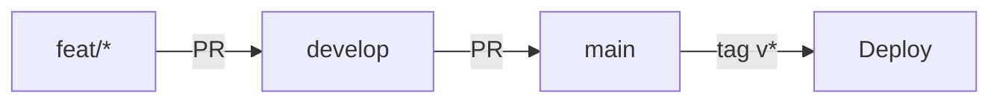
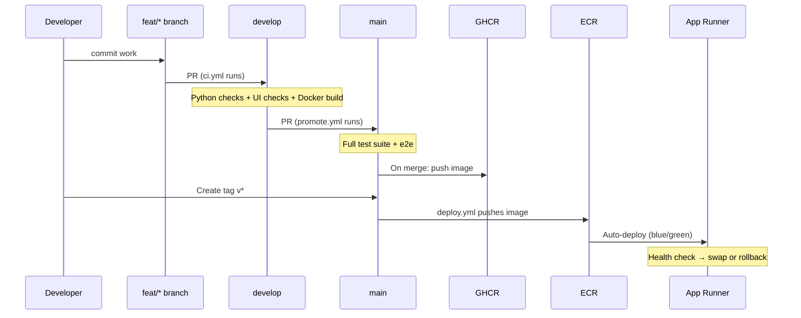
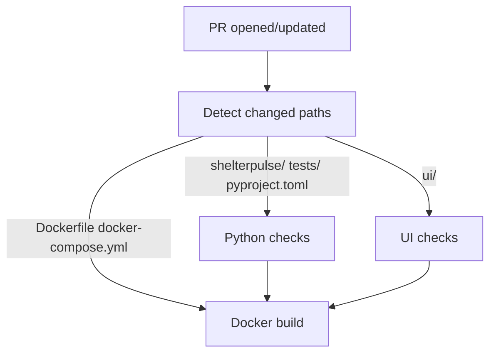
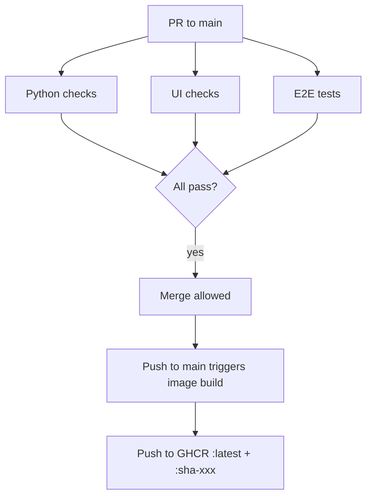
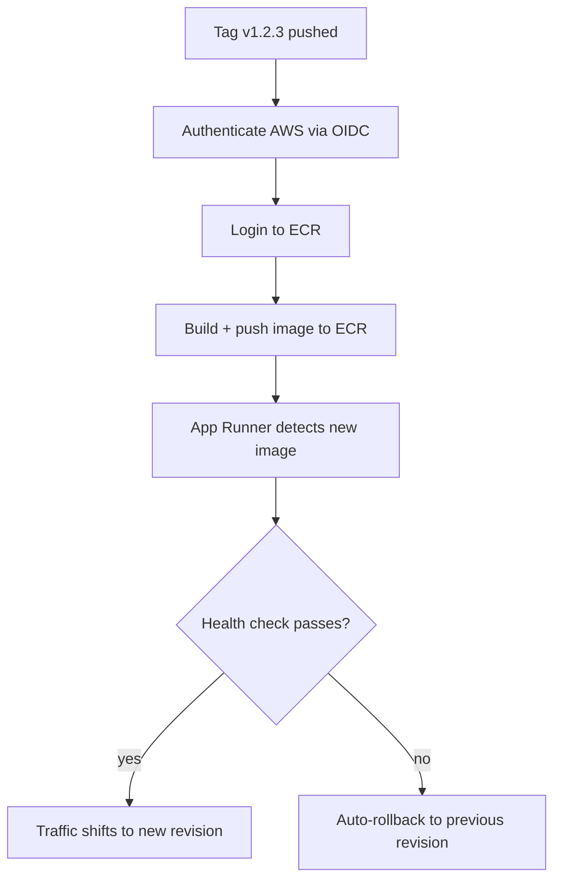

# CI/CD Workflows

## Branch Strategy

All work flows through pull requests. No direct pushes to `develop` or `main`.

## Workflows

| File | Trigger | Purpose |
|------|---------|---------|
| `ci.yml` | PR → `develop` | Lint, test, build (quality gate) |
| `promote.yml` | PR → `main` / push to `main` | Full suite + GHCR image push |
| `deploy.yml` | Tag `v*` | Push to ECR → App Runner blue/green |
| `publish-pypi.yml` | PR merge to `develop` touching `shelterpulse/core/` | Build + publish `shelterpulse-core` to PyPI |

## Promotion Flow

## CI on develop (`ci.yml`)

Runs on every PR targeting `develop`. Path-detection skips irrelevant jobs.

**Python checks** (composite action `.github/actions/ci-python/`):
- `uv sync --all-groups`
- `tox -e lint` — pyrefly type checking
- `tox -e security` — bandit scan
- `tox -e test` — pytest unit tests with coverage

**UI checks** (composite action `.github/actions/ci-ui/`):
- `npm ci`
- `npm run type-check`
- `npm run lint`
- `npm run build`
- Cypress smoke test against static export

**Docker build**: builds the image without pushing (validates Dockerfile is sound).

## Promotion to main (`promote.yml`)

Runs on PRs targeting `main` and on push to `main` (after merge).

**E2E tests**: docker compose up → pytest e2e suite → compose down.

## Deploy (`deploy.yml`)

Triggered by pushing a version tag (`v*`).

## Composite Actions

Located in `.github/actions/`:

| Action | Used by | What it does |
|--------|---------|--------------|
| `ci-python/` | ci.yml, promote.yml | Install uv, sync deps, run lint + security + tests |
| `ci-ui/` | ci.yml, promote.yml | Install node, npm ci, type-check + lint + build + Cypress |
| `ci-docker/` | promote.yml | Build and push image to GHCR |

## Required Secrets & Variables

| Name | Where | Purpose |
|------|-------|---------|
| `GITHUB_TOKEN` | Built-in | GHCR authentication |
| `AWS_ROLE_ARN` | Repository secret | OIDC role for AWS access |

No static AWS credentials stored — authentication uses GitHub OIDC → IAM role assumption.

## Adding Required Status Checks

After workflows have run at least once, add required status checks to branch rulesets:

- **develop ruleset**: require `Python checks`, `UI checks`
- **main ruleset**: require `Python checks`, `UI checks`, `E2E tests`
