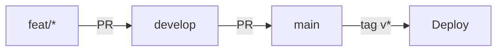
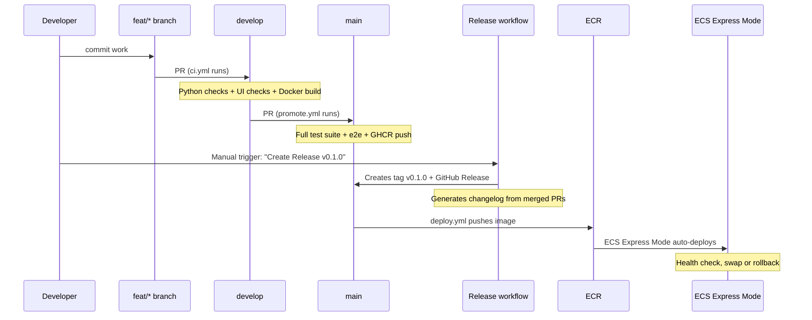
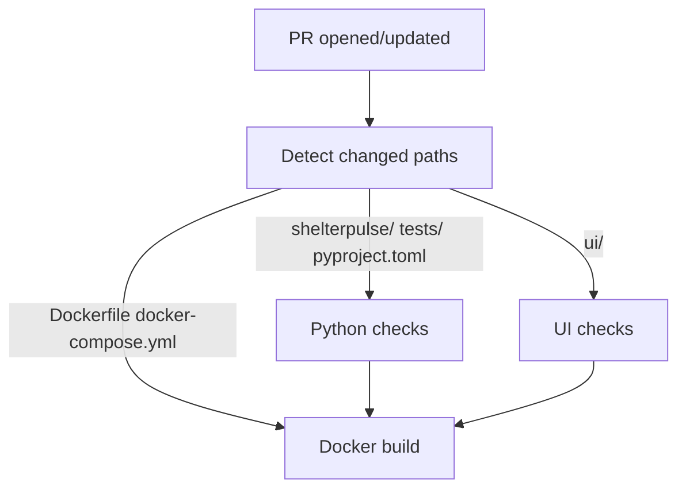
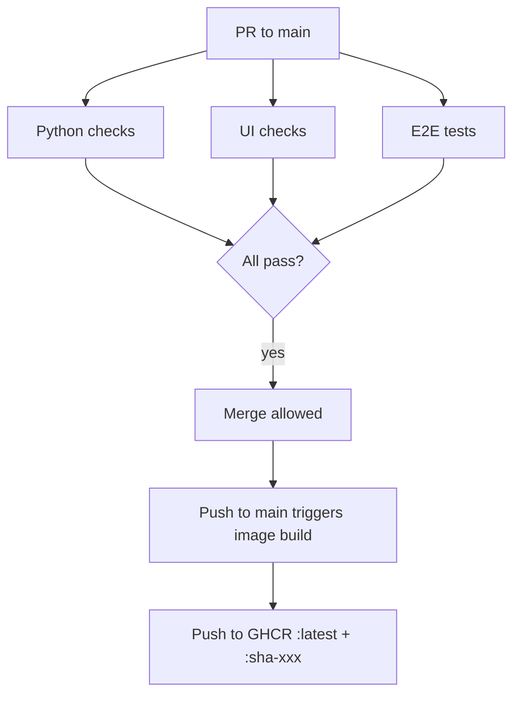
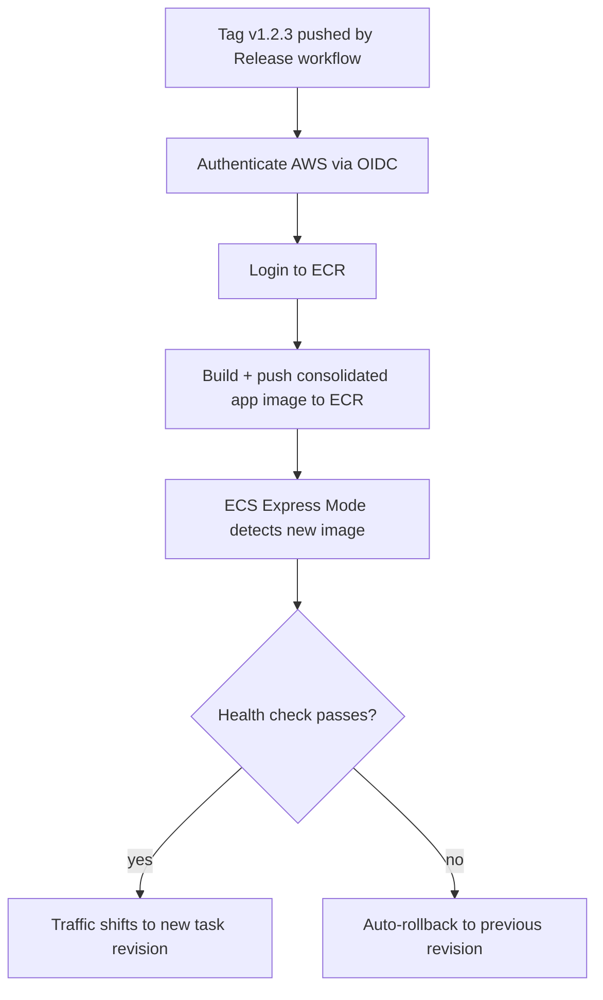

# CI/CD Workflows

> **Contributor reference**: this is CI/CD context, not the project README. For the project overview, see the [root README.md](../README.md).

## Branch Strategy

All work flows through pull requests. No direct pushes to `develop` or `main`.

## Workflows

| File | Trigger | Purpose |
|------|---------|---------|
| `ci.yml` | PR to `develop` | Lint, test, build (quality gate) |
| `promote.yml` | PR to `main` / push to `main` | Full suite + GHCR image push |
| `release.yml` | Manual (`workflow_dispatch`) on `main` | Create version tag + GitHub Release with changelog |
| `deploy.yml` | Tag `v*` pushed (by release workflow) | Build image, push to ECR, ECS Express Mode auto-deploys |

## Promotion Flow

## Release Process

Tags can only be created via the Release workflow (protected by tag ruleset).
No manual `git tag` + `git push` is allowed.

1. Ensure all work is merged to `main` via develop
2. Go to Actions, Release, Run workflow
3. Input version (semver, e.g., `0.1.0`)
4. Optionally check "dry run" to preview changelog
5. Workflow creates tag, GitHub Release with auto-changelog, triggers deploy

## CI on develop (`ci.yml`)

Runs on every PR targeting `develop`. Path-detection skips irrelevant jobs.

**Python checks** (composite action `.github/actions/ci-python/`):
- `uv sync --all-groups`
- `tox -e lint`: pyrefly type checking
- `tox -e security`: bandit scan
- `tox -e test`: pytest unit tests with coverage

**UI checks** (composite action `.github/actions/ci-ui/`):
- `npm ci`
- `npm run type-check`
- `npm run lint`
- `npm run build`
- Cypress smoke test against static export

**Docker build**: builds the image without pushing (validates Dockerfile is sound).

## Promotion to main (`promote.yml`)

Runs on PRs targeting `main` and on push to `main` (after merge).

**E2E tests**: docker compose up, pytest e2e suite, compose down.

## Deploy (`deploy.yml`)

Triggered automatically when the Release workflow pushes a `v*` tag.

## Composite Actions

Located in `.github/actions/`:

| Action | Used by | What it does |
|--------|---------|--------------|
| `ci-python/` | ci.yml, promote.yml | Install uv, sync deps, run lint + security + tests |
| `ci-ui/` | ci.yml, promote.yml | Install node, npm ci, type-check + lint + build + Cypress |
| `ci-docker/` | promote.yml | Build and push image to GHCR |

## Required Secrets and Variables

| Name | Where | Purpose |
|------|-------|---------|
| `GITHUB_TOKEN` | Built-in | GHCR authentication |
| `AWS_ROLE_ARN` | Repository secret | OIDC role for AWS access |

No static AWS credentials stored: authentication uses GitHub OIDC, IAM role assumption.

## Adding Required Status Checks

After workflows have run at least once, add required status checks to branch rulesets:

- **develop ruleset**: require `Python checks`, `UI checks`
- **main ruleset**: require `Python checks`, `UI checks`, `E2E tests`
