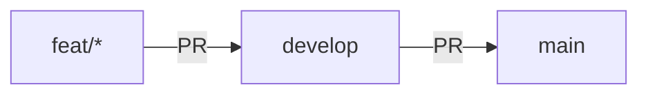

# CI/CD Workflows

## Branch Strategy

All work flows through pull requests. No direct pushes to `develop` or `main`.

## Workflows

| File | Trigger | Purpose |
|------|---------|---------|
| `ci.yml` | PR to `develop` | Lint, test, build (quality gate) |
| `promote.yml` | PR to `main` / push to `main` | Full suite + e2e + GHCR image push |

The ECS release pipeline (`auto-release.yml`, `release.yml`, `deploy.yml`) was retired in the
July 2026 static cutover: the public site is a static export on S3 + CloudFront with no CI
deploy step (see `docs/static-cutover.md`), and the GHCR image from `promote.yml` covers the
clone-and-run path. Recover the old workflows from git history if a deployed backend ever
returns.

## Whitepaper build

`ci.yml` includes a path-gated whitepaper job (`.github/actions/ci-whitepaper`) that rebuilds
the whitepaper PDF when `docs/whitepaper/**` changes.
