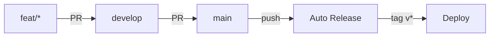
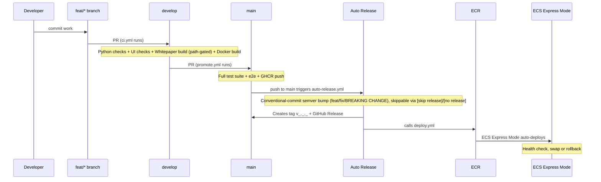
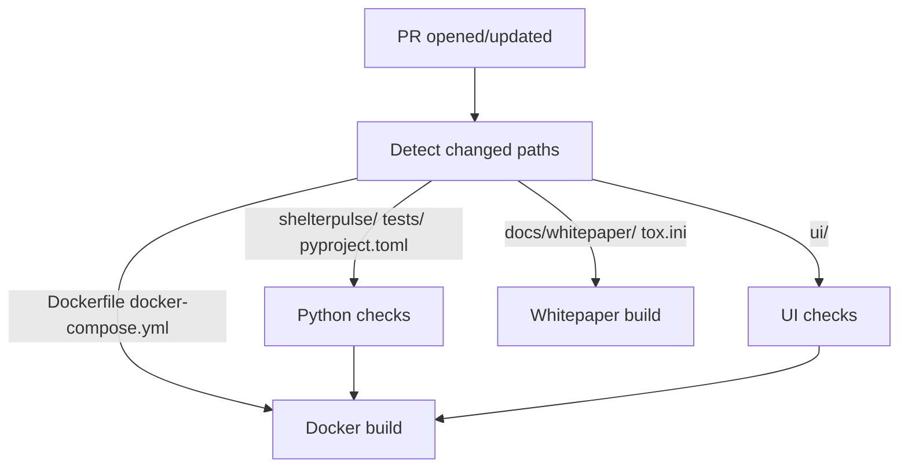
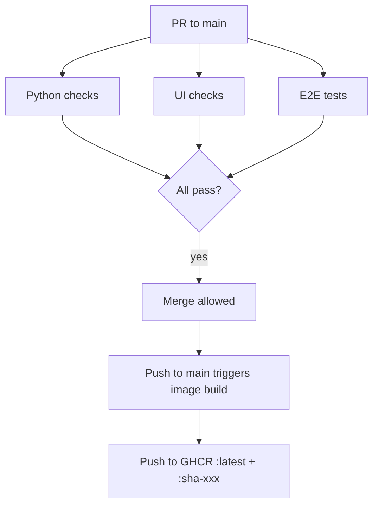
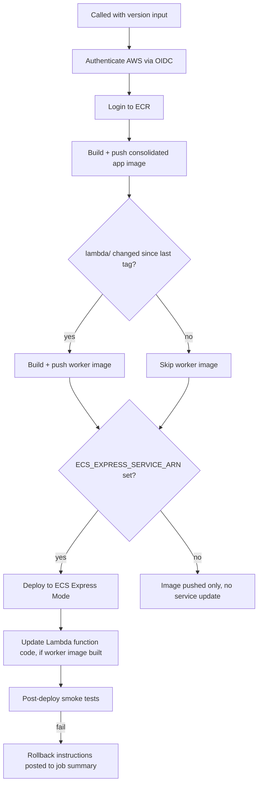

# CI/CD Workflows

## Branch Strategy

All work flows through pull requests. No direct pushes to `develop` or `main`.

## Workflows

| File | Trigger | Purpose |
|------|---------|---------|
| `ci.yml` | PR to `develop` | Lint, test, build (quality gate) |
| `promote.yml` | PR to `main` / push to `main` | Full suite + GHCR image push |
| `auto-release.yml` | Push to `main` | Normal release path. Auto-bumps semver from conventional commit prefixes, tags, creates a GitHub Release, calls `deploy.yml`. No manual step. |
| `release.yml` | Manual (`workflow_dispatch`) on `main` | Manual hotfix escape hatch, kept for cases outside the automatic flow (e.g. a controlled re-release). Not used in normal operation. |
| `deploy.yml` | Reusable (`workflow_call`), invoked by `auto-release.yml` or `release.yml` | Build + push image(s) to ECR, deploy to ECS Express Mode, run post-deploy smoke tests |

## Promotion Flow

## Release Process

Two paths exist; only the first is normal usage.

### Automatic (normal path)

`auto-release.yml` runs on every push to `main`:

1. Reads commits since the last tag and picks a bump: `BREAKING CHANGE:`/`!:` -> major, `feat:` -> minor, `fix:` -> patch. No matching prefix -> no release.
2. Creates the tag and GitHub Release (auto-generated changelog).
3. Calls `deploy.yml` directly with the new version.

Skip a release for a given push by including `[skip release]` or `[no release]` in the commit message.

### Manual (hotfix escape hatch)

`release.yml` is a manual `workflow_dispatch`, kept for cases outside the automatic flow, for example a hotfix that needs a controlled or specific version. Not used in normal operation.

1. Go to Actions, Release, Run workflow
2. Input version (semver, e.g. `0.1.0`)
3. Optionally check "dry run" to preview the changelog
4. Workflow creates the tag, GitHub Release, and calls `deploy.yml`

Tags are only ever created by one of these two workflows (protected by tag ruleset). No manual `git tag` + `git push`.

## CI on develop (`ci.yml`)

Runs on every PR targeting `develop`. Path-detection skips irrelevant jobs.

**Python checks** (composite action `.github/actions/ci-python/`):
- `uv sync --all-groups --extra store`
- `tox -e lint`: pyrefly type checking
- `tox -e security`: bandit scan
- `tox -e test`: pytest unit tests with coverage

**UI checks** (composite action `.github/actions/ci-ui/`):
- `npm ci`
- `npm run type-check`
- `npm run lint`
- `npm run build`
- Cypress smoke test against static export

**Whitepaper build** (composite action `.github/actions/ci-whitepaper/`): installs pandoc + pdflatex, runs `tox -e whitepaper`, verifies the PDF was produced. Gated on changes to `docs/whitepaper/**` or `tox.ini`.

**Docker build**: builds the image without pushing (validates Dockerfile is sound).

## Promotion to main (`promote.yml`)

Runs on PRs targeting `main` and on push to `main` (after merge).

**E2E tests**: docker compose up, pytest e2e suite, compose down.

## Deploy (`deploy.yml`)

Reusable workflow (`workflow_call`), invoked with a `version` input by either `auto-release.yml` or `release.yml`. Not triggered directly by a tag push.

Post-deploy smoke tests (both gated on `ECS_EXPRESS_SERVICE_ARN` being set) exercise the fast synchronous API layer, the full async job lifecycle (`POST /optimize/builder` -> SQS -> Lambda -> webhook -> results, the exact chain documented in [ADR-010](../docs/adr/010-async-worker-production-hardening.md)), and a live Cypress smoke run against the deployed UI.

## Composite Actions

Located in `.github/actions/`:

| Action | Used by | What it does |
|--------|---------|--------------|
| `ci-python/` | ci.yml, promote.yml | Install uv, sync deps, run lint + security + tests |
| `ci-ui/` | ci.yml, promote.yml | Install node, npm ci, type-check + lint + build + Cypress |
| `ci-whitepaper/` | ci.yml | Install pandoc/pdflatex, build the whitepaper PDF, verify output |
| `ci-docker/` | Not currently used | Reusable GHCR build+push, parameterized by token and SHA. `promote.yml`'s `ghcr` job currently inlines an equivalent login/build/push sequence directly instead of calling this action. Kept as the intended target for de-duplicating that job; migrate `promote.yml` to call it, or remove it, once that consolidation happens. |
