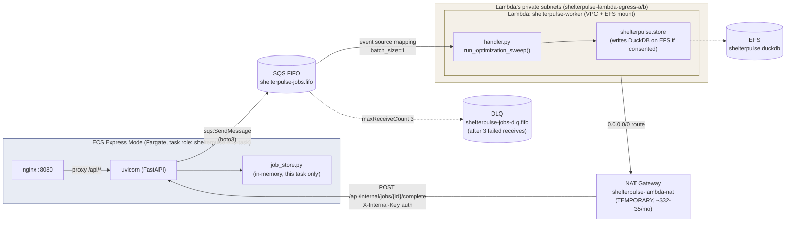
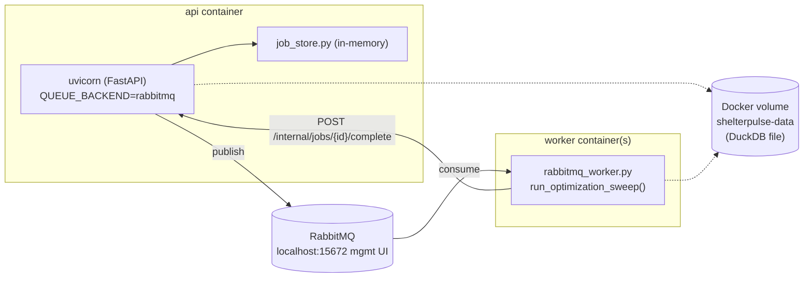

# Async Workers Architecture

The BO optimization sweep (~30s) is offloaded to background workers via a queue abstraction.

## Architecture Diagram

### Production (AWS)



The full pipeline (API → SQS → Lambda → webhook → results) runs end-to-end in production. Lambda's webhook callback requires internet egress while also being VPC-attached (for its EFS mount), and Lambda ENIs never get public IPs — a NAT Gateway is the only way to satisfy both, hence the dedicated egress subnets in the diagram above. See [ADR-010](../adr/010-async-worker-production-hardening.md) for the full fix chain and why `API_URL` needs the `/api` prefix.

### Local (docker-compose)



Scale workers with `docker compose up --scale worker=4`.

## Feature Flag

`QUEUE_BACKEND` environment variable selects the dispatch backend:
- `sync` (default): In-process execution, no external dependencies. Tests and CI use this.
- `rabbitmq`: Publishes to RabbitMQ. Worker containers consume. Used in docker-compose.
- `sqs`: Publishes to AWS SQS FIFO queue. Lambda consumes. Used in production.

## Job Lifecycle

1. UI calls `POST /optimize/builder`
2. API generates `job_id`, publishes to queue, returns `202 {job_id, status: "queued"}`
3. Worker consumes job, runs `run_optimization_sweep()`
4. Worker calls `POST /internal/jobs/{job_id}/complete` (or `/fail`) with results, authenticated via `X-Internal-Key`
5. UI subscribes to `GET /optimize/{job_id}/stream` (SSE) or polls `GET /optimize/{job_id}/status`
6. UI fetches `GET /optimize/{job_id}/results`

If a worker never calls back (crash, network failure, bad auth), the job would hang forever without a safeguard. `JobStore.sweep_stale()` (called lazily on every `create()` and `count_active_by_ip()`) fails any `queued`/`running` job whose `updated_at` is older than 5 minutes with `error: "Job timed out"`, and notifies any SSE subscriber so the UI shows an error instead of hanging. It also purges `completed`/`failed` jobs older than 30 minutes to bound memory growth. See [ADR-010](../adr/010-async-worker-production-hardening.md).

## Queue Module Structure

```
shelterpulse/queue/
  __init__.py           # Factory: get_publisher() reads QUEUE_BACKEND
  interface.py           # Protocol: QueuePublisher, ProgressListener
  sync_backend.py         # In-process (no queue, default)
  rabbitmq_backend.py     # aio-pika publisher
  sqs_backend.py          # boto3 SQS publisher
  rabbitmq_worker.py      # Consumer process (docker-compose)
  job_store.py            # In-memory job state tracking + SSE pub/sub + TTL sweep
```

## Internal Webhook Endpoints

All authenticated via `X-Internal-Key` header (must match on both the caller and the API):
- `POST /internal/jobs/{job_id}/progress` - Worker reports progress
- `POST /internal/jobs/{job_id}/complete` - Worker reports completion with results
- `POST /internal/jobs/{job_id}/fail` - Worker reports failure

## Lambda Worker

```
lambda/
  handler.py    # SQS event -> run_optimization_sweep() -> webhook results; also calls
                # shelterpulse.store directly (save_run/log_consent) if the user consented
  Dockerfile    # python:3.12-slim + optimize/store deps + awslambdaric (lean, no FastAPI)
```

Lambda is triggered by the SQS event source mapping (`batch_size=1`, `maximum_concurrency=5`). It runs inside the VPC with an EFS mount at `/mnt/efs` so it can write to the same `shelterpulse.duckdb` file the API reads from. Timeout 240s, memory 1024MB. Cold start ~1-3s, a typical sweep ~30s-3min depending on `n_candidates`/`n_replications`.

## Current AWS Resources (production)

All defined in `infra/async-workers/main.tf` (Terraform, applied manually — see [deployment.md](deployment.md)) except the ECS task role, which is also in that same file but attached to the ECS Express service imperatively via `--task-role-arn` (Express Mode isn't Terraform-managed, see ADR-007).

| Resource | Name / ID | Purpose |
|---|---|---|
| SQS FIFO queue | `shelterpulse-jobs.fifo` | Job dispatch, `content_based_deduplication`, 1-day retention |
| SQS DLQ | `shelterpulse-jobs-dlq.fifo` | After 3 failed receives, 14-day retention |
| Lambda function | `shelterpulse-worker` | BO sweep worker, VPC + EFS attached |
| EFS file system | `shelterpulse-data` | Shared DuckDB file, mounted by Lambda at `/mnt/efs` |
| Lambda IAM role | `shelterpulse-lambda-worker` | SQS consume, EFS mount, CloudWatch logs, VPC ENI management |
| ECS task IAM role | `shelterpulse-ecs-task` | `sqs:SendMessage` + `sqs:GetQueueAttributes` on the jobs queue only |
| ECR repo | `shelterpulse-worker` | Lambda container image |
| NAT Gateway (**temporary**) | `shelterpulse-lambda-nat` | Lambda's only path to the internet for its webhook callback |
| Private subnets (**temporary**) | `shelterpulse-lambda-egress-a`/`b` | Dedicated to Lambda; route `0.0.0.0/0` through the NAT Gateway above without touching ECS/ALB's subnets |

Note: the ECS/API side does **not** currently have an EFS mount (no `volumes`/`mountPoints` on the task definition), so `save_run`/`log_consent` calls from the synchronous API path write to an ephemeral local path inside the container, not the shared EFS file. Only Lambda's writes are durable today.

## Cost

- SQS: 1M requests/month free tier ($0)
- Lambda: 1M invocations + 400K GB-seconds free tier ($0)
- EFS: ~$0.01/month at current volume (< 100KB)
- RabbitMQ: only in docker-compose (no prod cost)
- **NAT Gateway: ~$32-35/month** — temporary, intended teardown once no longer needed (see the resource table above for the exact resources to remove, and [ADR-010](../adr/010-async-worker-production-hardening.md) for why it's required). This is the one line item that breaks the otherwise-$0 async pipeline, and it's the reason it's scoped as temporary rather than left running indefinitely.

## See Also

- [ADR-008: Queue Abstraction](../adr/008-queue-abstraction.md)
- [ADR-009: DuckDB over ClickHouse](../adr/009-duckdb-over-clickhouse.md)
- [ADR-010: Async Worker Production Hardening](../adr/010-async-worker-production-hardening.md)
- [Docker Local Testing](../docker-local-testing.md)
- [Deployment Architecture](deployment.md)
