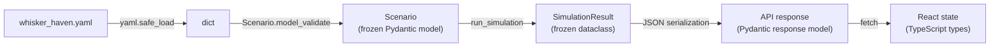

# Data Flow

End-to-end request flow for the primary user journey: load scenario → optimize → compare.

```mermaid
sequenceDiagram
  actor Manager as Shelter Manager
  participant UI as Next.js UI<br/>(localhost:3000)
  participant API as FastAPI<br/>(localhost:8000)
  participant Core as shelterpulse.core
  participant Opt as optimize/

  Manager->>UI: Open app (Whisker Haven pre-loaded)
  UI->>API: GET /scenario/whisker-haven
  API->>Core: load_scenario(whisker_haven.yaml)
  Core-->>API: Scenario (validated Pydantic model)
  API-->>UI: ScenarioResponse (JSON)
  UI-->>Manager: Show scenario summary + cat flow diagram

  Manager->>UI: "Run baseline"
  UI->>API: POST /simulate {scenario_id, seed=42}
  API->>Core: run_simulation(scenario, seed=42)
  Core-->>API: SimulationResult (flow counts, queue depths, utilization, cost)
  API-->>UI: SimulationResponse (JSON)
  UI-->>Manager: Show bottleneck chart (isolation · medical clearance queue)

  Manager->>UI: "Optimize $5,000 budget"
  UI->>API: POST /optimize {scenario_id, budget=5000}
  API->>Opt: run_optimization_sweep(scenario, budget)
  loop per candidate allocation (~25–40 evaluations)
    Opt->>Core: evaluate_candidate(allocation, scenario, seed_set)
    Core-->>Opt: EvaluationResult (overflow cat-days, feasibility, cost)
  end
  Opt-->>API: OptimizationResult (best allocation + uncertainty)
  API-->>UI: OptimizationResponse (JSON)
  UI-->>Manager: Show winning allocation + uncertainty bands

  Manager->>UI: "Compare vs baselines"
  UI->>API: POST /compare {scenario_id, allocations: [best, equal, all-in, heuristic]}
  API->>Core: run_simulation() × N replications × 4 allocations
  Core-->>API: ComparisonResult (metrics per allocation)
  API-->>UI: ComparisonResponse (JSON)
  UI-->>Manager: Side-by-side comparison table + chart

  Manager->>UI: "Export"
  UI->>API: GET /export/{run_id}
  API->>Core: export_run(run_id)
  Core-->>API: ExportBundle (scenario YAML + seeds + metrics CSV)
  API-->>UI: ZIP download
```

## Schema flow


