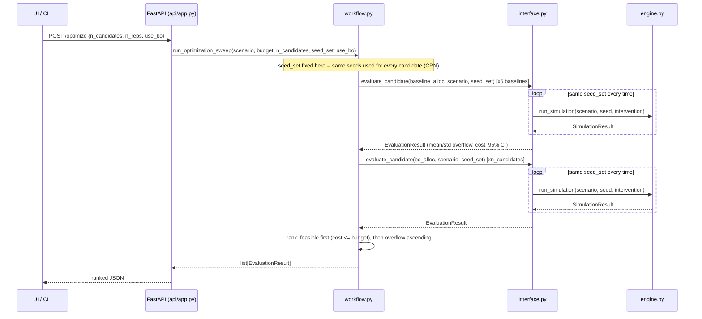
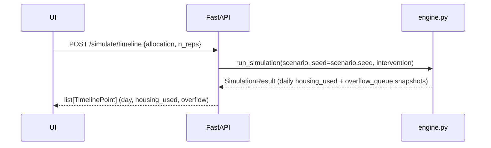
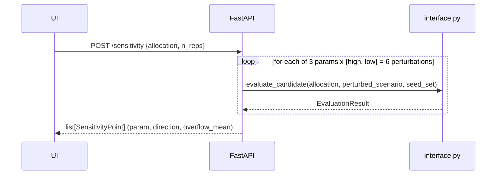

# Data Flow

End-to-end request flow for the primary user journey: configure, simulate, optimize.

## Optimization sweep (primary path)

## Single simulation (timeline / sensitivity)

## Sensitivity analysis (tornado chart)

## Schema flow

```mermaid
graph LR
    yaml["scenarios/whisker_haven.yaml"] -->|yaml.safe_load| raw["dict"]
    raw -->|Scenario.model_validate| model["Scenario\n(frozen Pydantic model)"]
    model -->|resolve_intervention| ip["InterventionParams\n(resource deltas)"]
    ip -->|run_simulation| result["SimulationResult\n(one replication)"]
    result -->|run_paired| mc["MonteCarloSummary\n(mean/std/95% CI)"]
    mc -->|JSON serialization| resp["API response\n(Pydantic response model)"]
    resp -->|fetch| ui["React state\n(TypeScript types)"]
```

