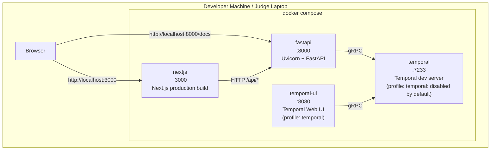
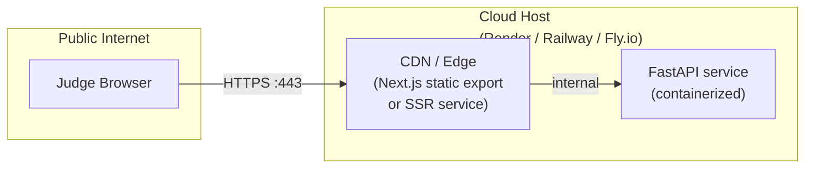
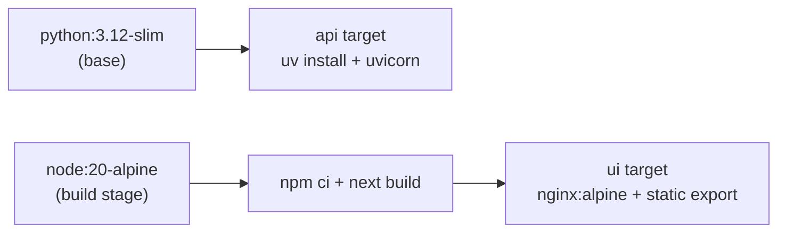

# Deployment Architecture

## Local development (docker compose up)



Enable Temporal services:
```bash
docker compose --profile temporal up
```

## Cloud deployment (Phase 3)



**Deployment strategy:**
- FastAPI container built from `Dockerfile` (Python 3.12-slim base)
- Next.js either: (a) built as static export served from FastAPI's static files, or
  (b) deployed as a separate service on the same host
- Choice made at deployment time (Phase 3) based on host friction
- No secrets beyond a deploy token: synthetic data only, no auth

## Dockerfile targets


