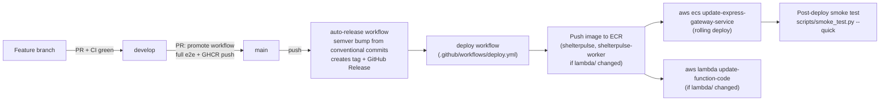
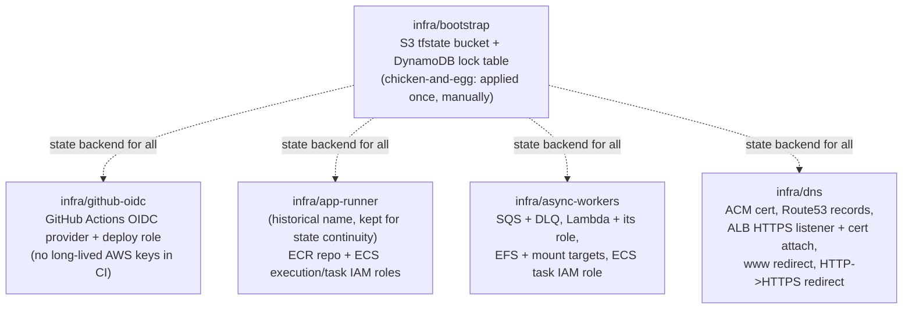

# Deployment Architecture

## Local development (docker compose up)

```
docker compose up --build -d
```

Starts 4 services:
- **rabbitmq** (port 5672): Message broker for async optimization jobs
- **api** (port 8000): FastAPI with QUEUE_BACKEND=rabbitmq, publishes to RabbitMQ
- **worker**: Consumes jobs from RabbitMQ, runs BO sweep, calls API webhook
- **ui** (port 3000): Next.js static export served by nginx

Flow: UI -> API -> RabbitMQ -> Worker -> API webhook -> UI polls/streams results

## Production (AWS ECS Express Mode)

Single consolidated container (nginx + uvicorn) deployed via ECS Express Mode, one Fargate task behind one ALB:
- nginx listens on :8080 (container port), serves the static Next.js export at `/`
- nginx proxies `/api/*` to uvicorn on `127.0.0.1:8000` (trailing slash strips the prefix)
- One ALB, one HTTPS URL, no CORS
- ALB has an HTTP (:80) listener that 301-redirects to HTTPS (:443); nginx's own root redirect (`/` → `/en`) follows `X-Forwarded-Proto` from the ALB when present, falling back to the request's own scheme for local `docker run -p 8080:8080` access

Async workers in production:
- API publishes to SQS FIFO queue (`shelterpulse-jobs.fifo`) via boto3
- Lambda function (`shelterpulse-worker`) consumes from SQS
- Lambda runs in VPC with EFS mount (for DuckDB persistence)
- Lambda calls a webhook back on the API with results, authenticated via `X-Internal-Key`

See [async-workers.md](async-workers.md) for the full diagram, current resource list, and the NAT Gateway that gives Lambda's VPC-attached ENIs a path to the internet for the webhook callback (see [ADR-010](../adr/010-async-worker-production-hardening.md)).

## Deploy pipeline


```mermaid
flowchart LR
    dev["Feature branch"] -->|PR + CI green| develop["develop"]
    develop -->|PR: promote workflow\nfull e2e + GHCR push| main["main"]
    main -->|push| autorelease["auto-release workflow\nsemver bump from conventional commits\ncreates tag + GitHub Release"]
    autorelease --> deploy["deploy workflow\n(.github/workflows/deploy.yml)"]
    deploy --> ecr["Push image to ECR\n(shelterpulse, shelterpulse-worker\nif lambda/ changed)"]
    ecr --> ecs["aws ecs update-express-gateway-service\n(rolling deploy)"]
    ecr --> lambdaupdate["aws lambda update-function-code\n(if lambda/ changed)"]
    ecs --> smoke["Post-deploy smoke test\nscripts/smoke_test.py --quick"]
```

1. Push to `develop`: CI runs (lint + tests + Docker build)
2. PR `develop` -> `main`: promote workflow (full e2e + GHCR push)
3. Push to `main`: `auto-release.yml` reads conventional-commit prefixes since the last tag, bumps semver, creates the tag + GitHub Release, and calls `deploy.yml` directly (skippable per-push via `[skip release]`/`[no release]`). `release.yml` (manual `workflow_dispatch`) is a hotfix escape hatch for cases outside this automatic flow. Tags are never pushed manually.
4. Deploy: build image, push to ECR, `aws ecs update-express-gateway-service` (rolling deploy, zero-downtime), conditionally `aws lambda update-function-code` if `lambda/` changed since the previous tag
5. Smoke test: `scripts/smoke_test.py --quick` against the live URL
6. Rollback: redeploy previous image tag via the same `update-express-gateway-service` command

## Dockerfile targets

| Target | Purpose | Used by |
|--------|---------|--------|
| api | Python + uvicorn + optimize/worker/store/**aws** deps | docker-compose (api + worker) |
| ui | nginx + Next.js static export | docker-compose (ui) |
| app | nginx + uvicorn consolidated (built on `api`) | ECS production |

The `api`/`app` stages install the `aws` extra (`boto3`) — without it, any request that hits `QUEUE_BACKEND=sqs` fails with `ModuleNotFoundError` before it can publish to the queue. See [ADR-010](../adr/010-async-worker-production-hardening.md).

## Infrastructure (Terraform + some imperative CLI)

Terraform modules live in `infra/`, one state file per module (S3 backend, DynamoDB lock, `infra/backend.hcl`):


```mermaid
flowchart TD
    bootstrap["infra/bootstrap\nS3 tfstate bucket + DynamoDB lock table\n(chicken-and-egg: applied once, manually)"]
    oidc["infra/github-oidc\nGitHub Actions OIDC provider + deploy role\n(no long-lived AWS keys in CI)"]
    apprunner["infra/app-runner\n(historical name, kept for state continuity)\nECR repo + ECS execution/task IAM roles"]
    asyncworkers["infra/async-workers\nSQS + DLQ, Lambda + its role,\nEFS + mount targets, ECS task IAM role"]
    dns["infra/dns\nACM cert, Route53 records,\nALB HTTPS listener + cert attach,\nwww redirect, HTTP->HTTPS redirect"]

    bootstrap -.->|state backend for all| oidc
    bootstrap -.->|state backend for all| apprunner
    bootstrap -.->|state backend for all| asyncworkers
    bootstrap -.->|state backend for all| dns
```

**Not Terraform-managed:** the ECS Express Mode service/task definition itself (`shelterpulse` service in the `default` cluster). AWS's ECS Express Mode Terraform resource requires AWS provider v6.x; this repo is pinned to v5.x (see [ADR-007](../adr/007-ecs-express-mode.md)). It's created/updated imperatively via `aws ecs update-express-gateway-service` (see `deploy.yml` and the deploy pipeline above). This means task-level settings not covered by that CLI call (like the task IAM role) are set with a one-off `--task-role-arn` flag rather than tracked in `main.tf`, even though the role itself *is* defined in Terraform (`infra/async-workers/main.tf`).
