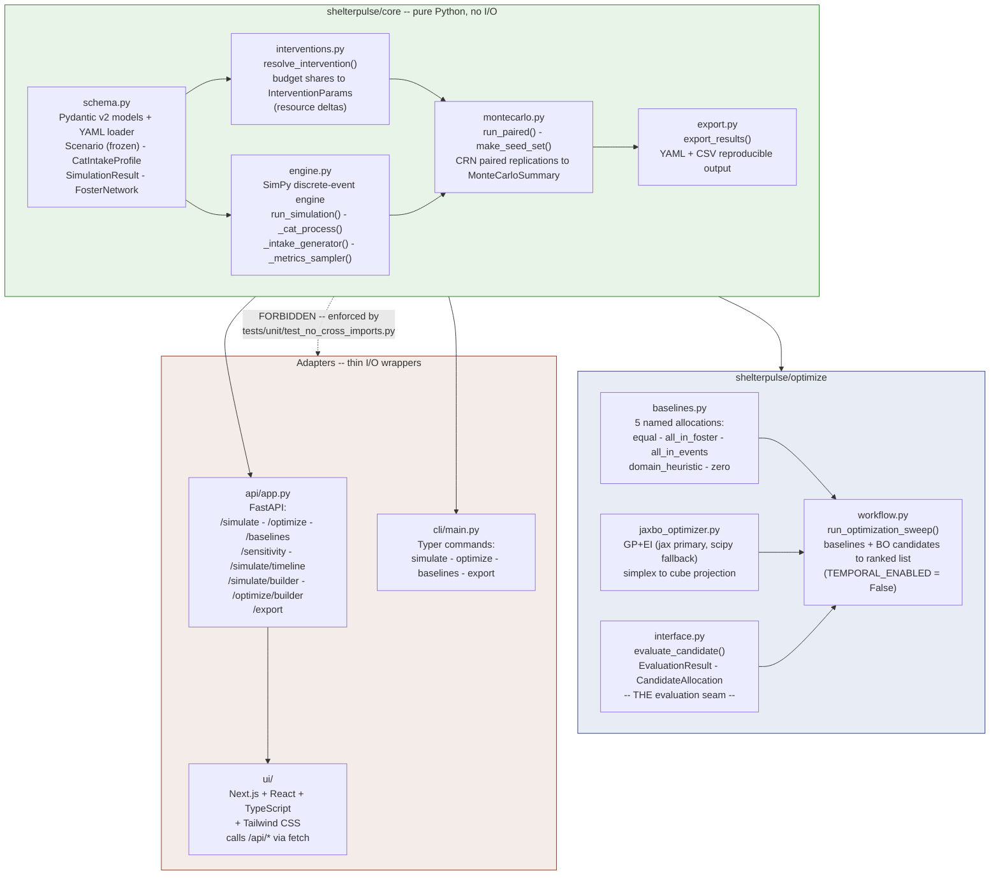

# Module Boundaries

The core architectural constraint: `shelterpulse/core` is a pure library with no I/O.
All adapters (API, CLI, UI) call into it; it never imports from them.



## The key invariant

```
shelterpulse.core  imports from  nowhere in shelterpulse.*
```

Enforced by `tests/unit/test_no_cross_imports.py` which runs in CI on every PR.

This boundary is what makes the core usable from the API, CLI, and future adapters without circular imports. It also makes the core testable in isolation: no mock of FastAPI or Next.js needed to test the simulation engine.
