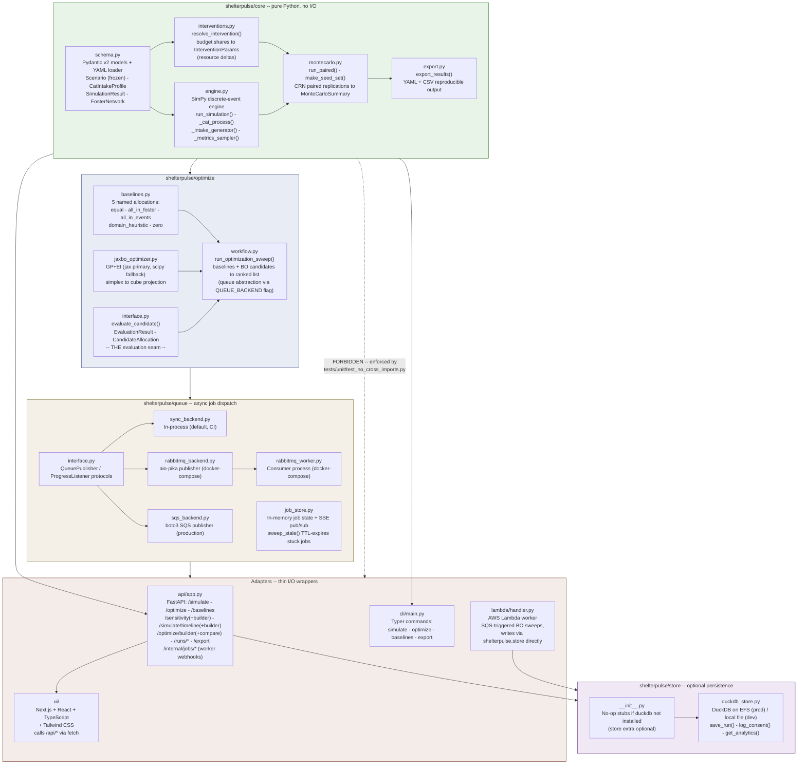

# Module Boundaries

The core architectural constraint: `shelterpulse/core` is a pure library with no I/O.
All adapters (API, CLI, UI) call into it; it never imports from them.


```mermaid
graph TD
    subgraph core["shelterpulse/core  --  pure Python, no I/O"]
        schema["schema.py\nPydantic v2 models + YAML loader\nScenario (frozen) - CatIntakeProfile\nSimulationResult - FosterNetwork"]
        engine["engine.py\nSimPy discrete-event engine\nrun_simulation() - _cat_process()\n_intake_generator() - _metrics_sampler()"]
        interventions["interventions.py\nresolve_intervention()\nbudget shares to InterventionParams\n(resource deltas)"]
        montecarlo["montecarlo.py\nrun_paired() - make_seed_set()\nCRN paired replications to MonteCarloSummary"]
        export_mod["export.py\nexport_results()\nYAML + CSV reproducible output"]

        schema --> engine
        schema --> interventions
        interventions --> montecarlo
        engine --> montecarlo
        montecarlo --> export_mod
    end

    subgraph optimize["shelterpulse/optimize"]
        interface["interface.py\nevaluate_candidate()\nEvaluationResult - CandidateAllocation\n-- THE evaluation seam --"]
        baselines["baselines.py\n5 named allocations:\nequal - all_in_foster - all_in_events\ndomain_heuristic - zero"]
        jaxbo_opt["jaxbo_optimizer.py\nGP+EI (jax primary, scipy fallback)\nsimplex to cube projection"]
        workflow["workflow.py\nrun_optimization_sweep()\nbaselines + BO candidates to ranked list\n(queue abstraction via QUEUE_BACKEND flag)"]

        baselines --> workflow
        jaxbo_opt --> workflow
        interface --> workflow
    end

    subgraph queue["shelterpulse/queue  --  async job dispatch"]
        queue_abs["interface.py\nQueuePublisher / ProgressListener protocols"]
        sync_be["sync_backend.py\nIn-process (default, CI)"]
        rabbitmq_be["rabbitmq_backend.py\naio-pika publisher (docker-compose)"]
        sqs_be["sqs_backend.py\nboto3 SQS publisher (production)"]
        rabbitmq_worker["rabbitmq_worker.py\nConsumer process (docker-compose)"]
        job_store["job_store.py\nIn-memory job state + SSE pub/sub\nsweep_stale() TTL-expires stuck jobs"]

        queue_abs --> sync_be
        queue_abs --> rabbitmq_be
        queue_abs --> sqs_be
        rabbitmq_be --> rabbitmq_worker
    end

    subgraph store["shelterpulse/store  --  optional persistence"]
        duckdb_store["duckdb_store.py\nDuckDB on EFS (prod) / local file (dev)\nsave_run() - log_consent() - get_analytics()"]
        store_init["__init__.py\nNo-op stubs if duckdb not installed\n(store extra optional)"]

        store_init --> duckdb_store
    end

    subgraph adapters["Adapters  --  thin I/O wrappers"]
        api_app["api/app.py\nFastAPI: /simulate - /optimize - /baselines\n/sensitivity(+builder) - /simulate/timeline(+builder)\n/optimize/builder(+compare) - /runs/* - /export\n/internal/jobs/* (worker webhooks)"]
        cli_main["cli/main.py\nTyper commands:\nsimulate - optimize - baselines - export"]
        ui_app["ui/\nNext.js + React + TypeScript\n+ Tailwind CSS\ncalls /api/* via fetch"]
        lambda_fn["lambda/handler.py\nAWS Lambda worker\nSQS-triggered BO sweeps,\nwrites via shelterpulse.store directly"]
    end

    core --> optimize
    core --> api_app
    core --> cli_main
    optimize --> queue
    queue --> adapters
    api_app --> store
    lambda_fn --> store
    api_app --> ui_app

    core -. "FORBIDDEN -- enforced by\ntests/unit/test_no_cross_imports.py" .-> adapters

    style core fill:#e8f4e8,stroke:#2d7a2d
    style optimize fill:#e8ecf4,stroke:#2d3d7a
    style queue fill:#f4f0e8,stroke:#7a6d2d
    style store fill:#f0e8f4,stroke:#5d2d7a
    style adapters fill:#f4ece8,stroke:#7a3d2d
```

## Module map

| Path | Purpose |
|------|---------|
| `shelterpulse/core/` | Pure library: simulation engine, Monte Carlo, schema, interventions. Zero I/O. |
| `shelterpulse/optimize/` | Sweep orchestrator, Bayesian optimizer, baselines, evaluation interface |
| `shelterpulse/queue/` | Async job dispatch: queue abstraction, sync/RabbitMQ/SQS backends, worker, in-memory job store |
| `shelterpulse/store/` | Optional DuckDB persistence (run history, consent log, analytics). No-op stubs when the `store` extra isn't installed. |
| `shelterpulse/api/` | FastAPI REST adapter (thin I/O wrapper) |
| `shelterpulse/cli/` | Typer CLI adapter (thin I/O wrapper) |
| `ui/` | Next.js + React + TypeScript + Tailwind CSS frontend |
| `lambda/` | AWS Lambda worker for SQS-triggered BO sweeps. Calls `shelterpulse.store` directly (not through the API) since it already runs the optimization in-process. |

Note: `job_store.py` (SSE/status tracking for in-flight jobs, in-memory) and `store/duckdb_store.py` (durable run history on disk/EFS) are two different things despite the similar name — the former is ephemeral request-scoped state, the latter is persisted history.

## The key invariant

```
shelterpulse.core  imports from  nowhere in shelterpulse.*
```

Enforced by `tests/unit/test_no_cross_imports.py` which runs in CI on every PR.

This boundary is what makes the core usable from the API, CLI, and future adapters without circular imports. It also makes the core testable in isolation: no mock of FastAPI or Next.js needed to test the simulation engine.
