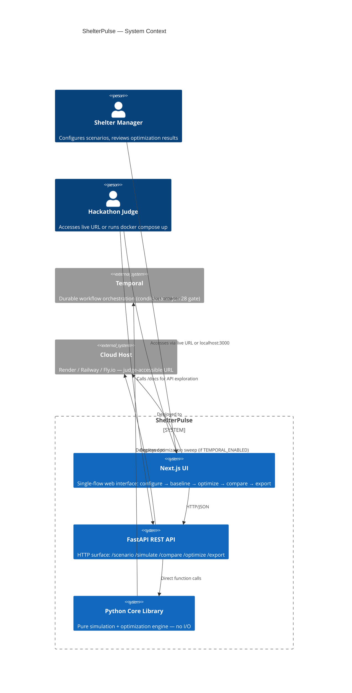

# System Overview

ShelterPulse system context: who uses it and how the major pieces connect.

```mermaid
C4Context
  title ShelterPulse — System Context

  Person(manager, "Shelter Manager", "Configures scenarios, reviews optimization results")
  Person(judge, "Hackathon Judge", "Accesses live URL or runs docker compose up")

  System_Boundary(sp, "ShelterPulse") {
    System(ui, "Next.js UI", "Single-flow web interface: configure → baseline → optimize → compare → export")
    System(api, "FastAPI REST API", "HTTP surface: /scenario /simulate /compare /optimize /export")
    System(core, "Python Core Library", "Pure simulation + optimization engine — no I/O")
  }

  System_Ext(temporal, "Temporal", "Durable workflow orchestration (conditional — Jun 28 gate)")
  System_Ext(cloud, "Cloud Host", "Render / Railway / Fly.io — judge-accessible URL")

  Rel(manager, ui, "Uses browser")
  Rel(judge, ui, "Accesses via live URL or localhost:3000")
  Rel(judge, api, "Calls /docs for API exploration")
  Rel(ui, api, "HTTP/JSON")
  Rel(api, core, "Direct function calls")
  Rel(core, temporal, "Delegates optimization sweep (if TEMPORAL_ENABLED)")
  Rel(ui, cloud, "Deployed to")
  Rel(api, cloud, "Deployed to")
```
