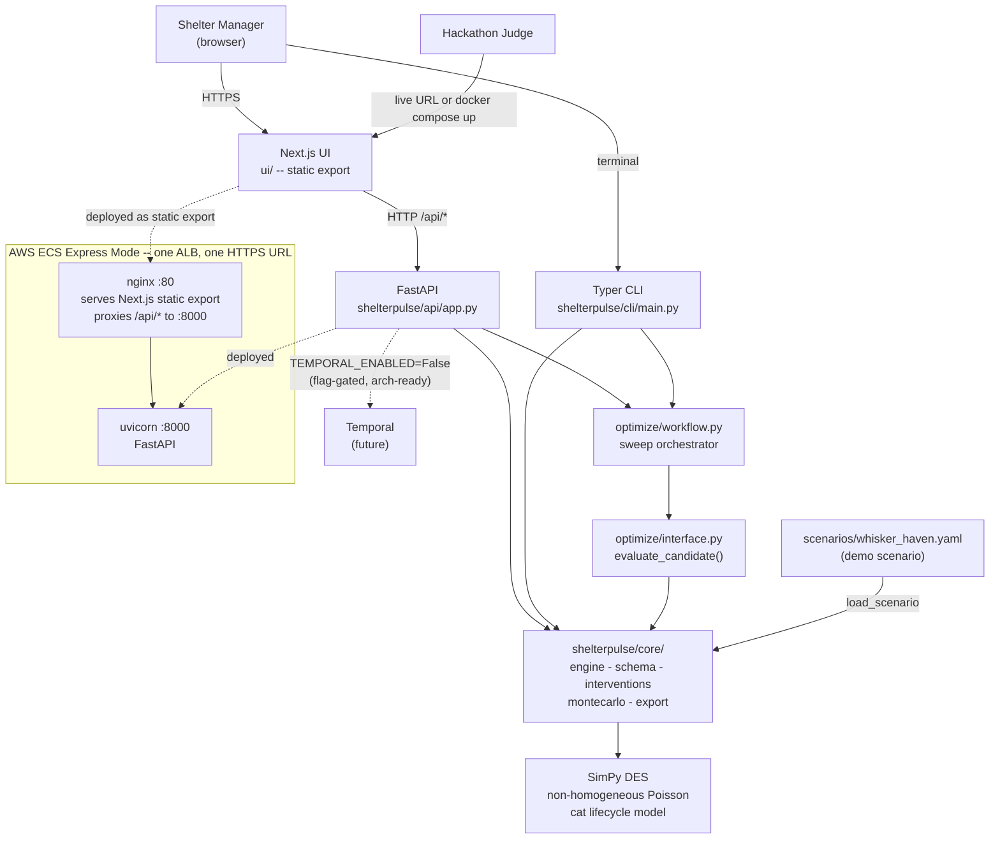

# System Overview

ShelterPulse system context: who uses it and how the major pieces connect.

## Deployment note

The `app` Docker target (Dockerfile multi-stage) bundles the Next.js static export and the FastAPI server into one image. nginx serves static files at `:80` and reverse-proxies `/api/*` to uvicorn at `:8000` -- one container, one ALB, one HTTPS URL, no CORS. See [ADR-011](../adr/011-ecs-express-mode.md).
