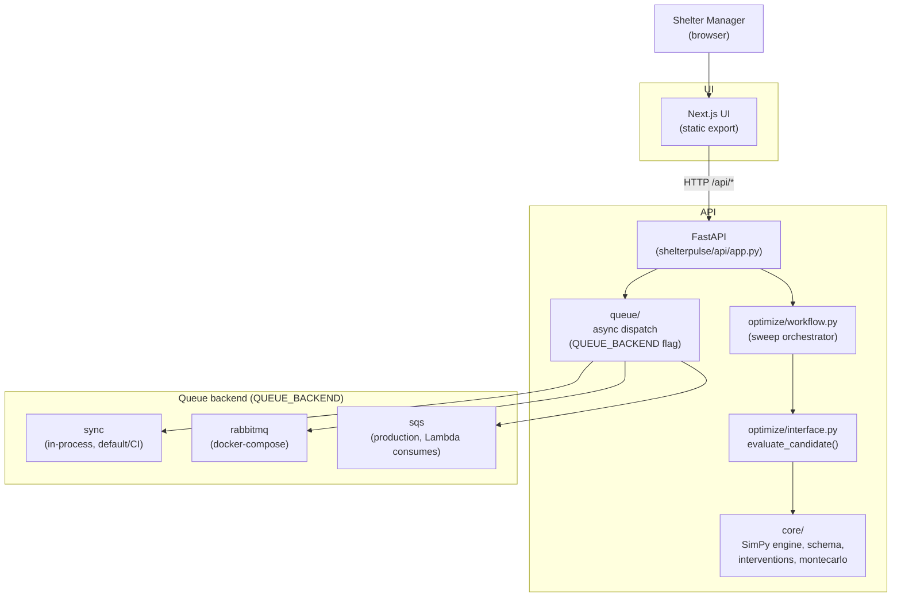

# System Overview

ShelterPulse system context: who uses it and how the major pieces connect.

```mermaid
flowchart TD
    user["Shelter Manager\n(browser)"]

    subgraph frontend["UI"]
        nextjs["Next.js UI\n(static export)"]
    end

    subgraph backend["API"]
        fastapi["FastAPI\n(shelterpulse/api/app.py)"]
        workflow["optimize/workflow.py\n(sweep orchestrator)"]
        interface["optimize/interface.py\nevaluate_candidate()"]
        core["core/\nSimPy engine, schema,\ninterventions, montecarlo"]
        queue["queue/\nasync dispatch\n(QUEUE_BACKEND flag)"]
    end

    subgraph backends["Queue backend (QUEUE_BACKEND)"]
        sync_b["sync\n(in-process, default/CI)"]
        rabbit_b["rabbitmq\n(docker-compose)"]
        sqs_b["sqs\n(production, Lambda consumes)"]
    end

    user --> nextjs
    nextjs -->|"HTTP /api/*"| fastapi
    fastapi --> workflow
    workflow --> interface
    interface --> core
    fastapi --> queue
    queue --> sync_b
    queue --> rabbit_b
    queue --> sqs_b
```

## Deployment modes

| Mode | UI | API | Queue backend | Notes |
|---|---|---|---|---|
| **Local (docker compose)** | nginx :3000 | uvicorn :8000 | RabbitMQ | 4 containers: api, ui, rabbitmq, worker |
| **Production** | same origin as API | nginx :8080 proxies to uvicorn | SQS + Lambda | One consolidated ECS Fargate task behind one ALB, no CORS |
| **CI / tests** | not started | in-process | sync | No external dependencies |

Production and local intentionally differ in topology (consolidated single container vs. four separate containers) but run the exact same application code, gated by the `QUEUE_BACKEND` env var — see [async-workers.md](async-workers.md).

## Key URLs

- Live app: https://shelter-pulse.com/en
- API docs: https://shelter-pulse.com/api/docs
- RabbitMQ (local): http://localhost:15672 (shelter/pulse)

## See also

- [Module Boundaries](module-boundaries.md) — the `core` isolation invariant
- [Data Flow](data-flow.md) — sequence diagrams for the primary request paths
- [Async Workers](async-workers.md) — queue abstraction, job lifecycle, current AWS resources
- [Deployment](deployment.md) — CI/CD pipeline, Terraform modules, Dockerfile targets
