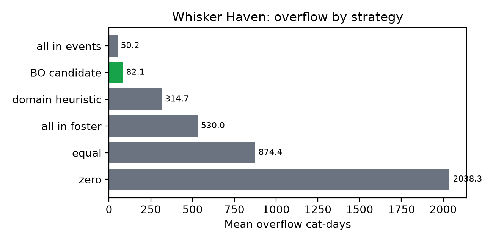
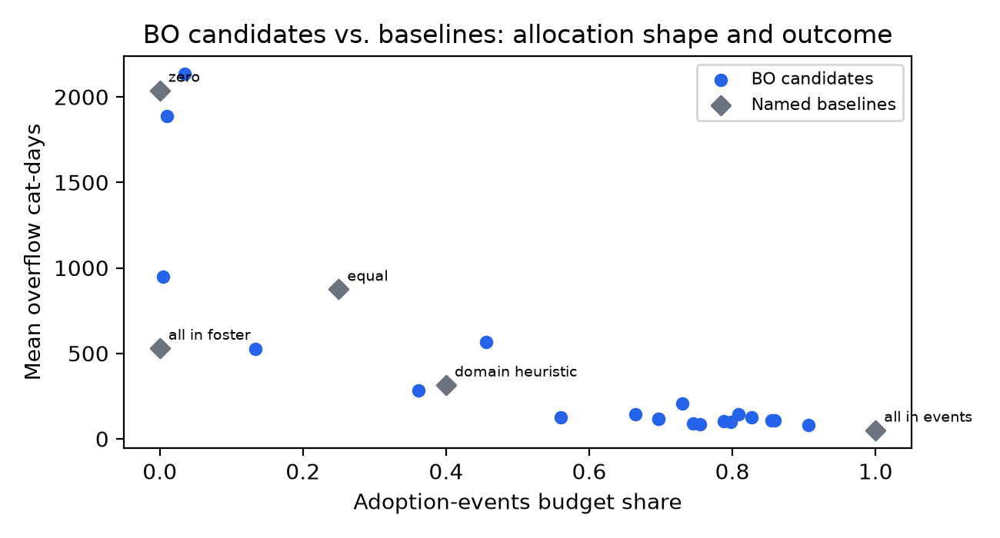
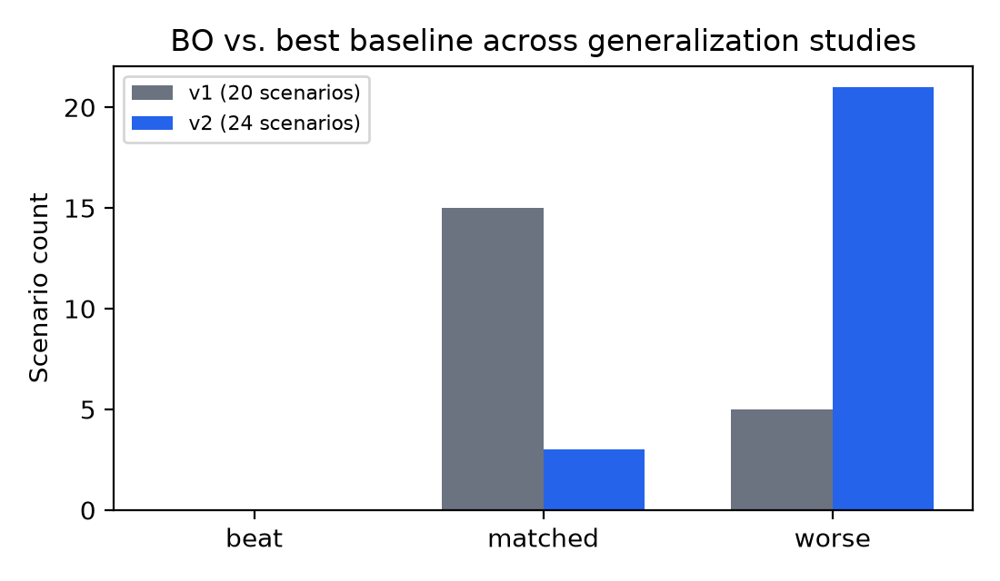
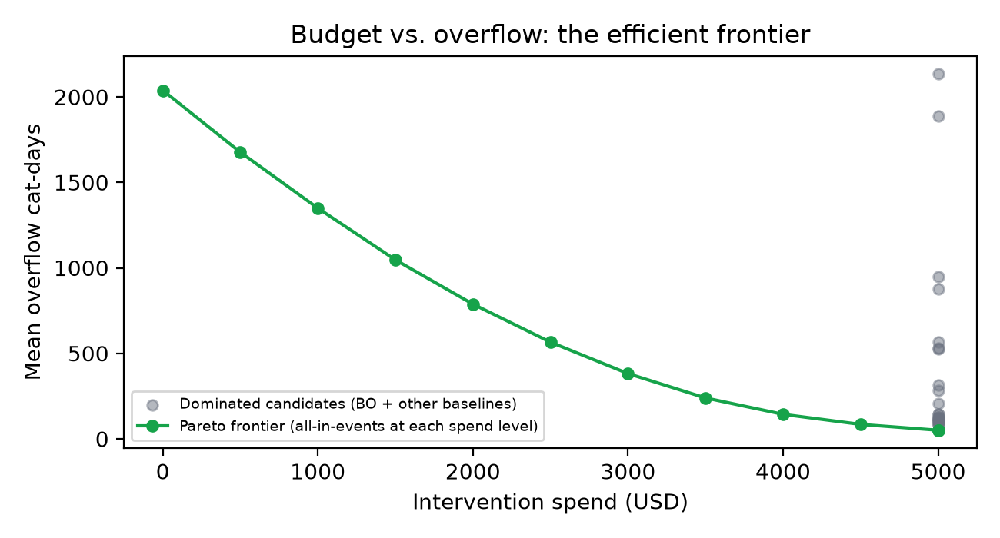

# Introduction

Kitten season creates a recurrent planning problem for shelters. Shelter Animals Count reported that neonates, weaned kittens, and juveniles represented 59% of cat intake across reporting organizations in 2025 [@shelteranimalscount2026]. Intake composition and timing vary by organization, but the operational consequence is consistent: housing, isolation, staff, foster, and adoption capacity interact as a coupled resource-allocation system under uncertain demand, the classical subject of queueing theory [@kleinrock1975queueing], and animal-sheltering research has separately identified capacity-interaction effects (space, staff time, and outcome pathways competing for the same constrained resources) as a distinct, under-studied operations problem [@horecka2022critical].

Managers must decide how to use limited intervention funds before they can observe the realized intake stream. ShelterPulse models four spending categories: foster support, extra clinic hours, temporary isolation capacity, and adoption events. These four were chosen because each maps to a distinct resource lever already present in the simulated shelter (foster network capacity, vet-tech service time, isolation slots, and adoption-wait duration respectively, see Intervention effects and cost semantics below); they are a modeling convenience covering the levers ShelterPulse's engine represents, not a claim that real shelters have exactly four independent spending categories. Its primary outcome is *overflow cat-days*, defined here as the time integral of the number of cats queued for general housing. One cat waiting for housing for one day contributes one overflow cat-day. In plain terms: it is a running total of waiting pressure, not a headcount at any single moment. For example, 5 cats each waiting 2 days for an open spot and 10 cats each waiting 1 day both total 10 overflow cat-days; a shelter can reach the same number by turning away a few cats for a long time or many cats for a short time, and the metric treats both as equally serious.

ShelterPulse is a decision-support prototype, not a calibrated prediction product. Its inputs are synthetic, intervention effects are scenario assumptions, and the model omits important real-world behavior. The intended contribution is a transparent computational workflow:

1. validate a versioned shelter scenario;
2. simulate stochastic intake and lifecycle queues;
3. evaluate allocations with aligned random streams;
4. report uncertainty and named baselines; and
5. retain machine-readable evidence for every published result.

# Related Work

Animal-shelter operations research has addressed complementary decisions. Bradley and Rajendran combine length-of-stay prediction with shelter-allocation decisions [@bradley2021shelter]. Kang and Han formulate operational schedules and space sharing across shelters in the Seoul capital area [@kang2019shelter]. Karsten et al. report an observational evaluation of Capacity for Care management across three shelters [@karsten2017capacity]. ShelterPulse differs in scope: it uses discrete-event simulation to explore within-shelter intervention allocation during a synthetic seasonal surge.

Simulation-based optimization and variance reduction are established methods. Law describes common random numbers (CRN) as a paired-comparison technique [@law2015simulation]. Stout and Goldie and Murphy et al. emphasize that effective CRN requires synchronized random sources, not merely reusing one initial seed [@stout2008common; @murphy2013common]. Bayesian optimization uses a probabilistic surrogate and an acquisition function to select expensive black-box evaluations [@snoek2012practical; @frazier2018tutorial]. ShelterPulse applies these techniques as engineering tools; it does not claim methodological novelty.

# System Model

## Scenario and lifecycle

A Pydantic schema validates the simulation horizon, base seed, intake profile, seasonal events, physical capacity, workforce, foster network, costs, interventions, and intervention budget. Unknown fields are rejected. Scenario values are assumptions, not estimates learned from shelter records.

<!-- FIGURE (not yet generated): scenario schema diagram -->

Each generated cat follows this implemented lifecycle:

1. intake profile assignment;
2. assessment by a vet-tech service resource;
3. optional isolation;
4. medical clearance by a vet-tech service resource;
5. immediate foster placement when the cat is eligible and a foster slot is available, otherwise a request for general housing;
6. an adoption-wait period; and
7. adoption or transfer.

{width=100%}

The model does not simulate euthanasia, returns after adoption, adopter choice, or transfers between modeled shelters. These are real, well-documented outcomes: post-adoption returns alone affect a meaningful share of placements and are predictable from animal age and breed [@powell2021characterizing]. They are omitted here because each requires its own outcome model (a return-probability function conditioned on animal and household features, an adopter-choice model, a euthanasia policy) that ShelterPulse's engine does not yet implement, not because they are judged unimportant. A follow-up model would add each as a further stochastic branch after adoption in the lifecycle above, conditioned on the same intake profile fields already tracked, and would need the underlying rates calibrated from real intake/outcome records rather than assumed. Cats still present at the simulation horizon are counted separately. Conservation is tested as

$$
N_{intake} = N_{adopted} + N_{transferred} + N_{remaining}.
$$

## Resources and workforce approximation

Housing, isolation, and foster capacity are finite `simpy.Resource` pools. A foster placement holds one foster slot until exit and therefore relieves general housing. Eligible cats are neonates, medical/critical cases, or cats arriving when housing is already full; if no foster slot is immediately available they join the normal housing path.

Workforce roles are simplified concurrent service pools. Configured FTE is rounded to a positive worker count for event scheduling, while `hours_per_day` is used to normalize reported utilization. This is not a shift-calendar or labor-scheduling model. Clinic and foster-coordination interventions reduce the corresponding service times according to scenario-configured additional-hours effects. This approximation is a known limitation and is described as such rather than as a replenished daily-hours queue.

## Intervention effects and cost semantics

An allocation consists of four non-negative budget shares whose sum cannot exceed one. Scenario-defined effect parameters translate dollars into:

- additional foster slots;
- faster foster coordination;
- faster vet-tech service;
- additional isolation slots; and
- a shorter adoption-wait distribution.

<!-- FIGURE (not yet generated): four-category budget allocation diagram -->

The intervention-spend constraint and simulated operating cost are separate quantities. `is_feasible` means allocated intervention spend is within the configured intervention budget. `allocated_intervention_spend` (allocation shares times the total intervention budget) is what this paper reports as "spend" throughout; `mean_total_cost`, the simulated downstream operating cost (fixed, variable, medical, and foster supply costs across the full simulation horizon), is a different, larger-magnitude quantity not meant to be compared against the $5,000 intervention budget, and is not the headline number here.

# Simulation Methodology

## Intake and service processes

ShelterPulse uses SimPy 4 [@simpy]. Intake is generated as a piecewise non-homogeneous Poisson process by thinning from the maximum configured rate. For candidate time $t$, an arrival is accepted with probability $\lambda(t)/\lambda_{max}$. Intake times and profiles are generated before lifecycle processes begin.

Assessment and healthy-clearance times use exponential distributions; medical-hold and isolation-clearance times use gamma distributions, as does adoption waiting for some age classes. Exponential and gamma distributions are standard choices for service and inter-event times in discrete-event simulation because they are non-negative, support the memoryless (exponential) or shape/scale-flexible (gamma) behavior typical of service processes, and are well understood for downstream statistical analysis [@law2015simulation]. That standard-practice justification covers the choice of *distribution family*; it does not calibrate the specific rate and shape parameters used here, which are synthetic modeling assumptions encoded in the engine, not empirically fit service-time estimates from real shelter data.

## Overflow metric

The engine samples the housing queue hourly. If $Q_h$ is the number of cats waiting for housing at hour $h$, the reported metric is

$$
\text{overflow cat-days} = \sum_h \frac{Q_h}{24}.
$$

Housing occupancy at capacity with no waiting cat contributes zero overflow. This distinction prevents a full but stable shelter from being mislabeled as having one overflow cat-day for every hour of full occupancy.

## Paired-seed comparison

Every allocation in a sweep uses the same replication seed set. Reusing a seed alone is insufficient for CRN because intervention-dependent control flow can change random-number consumption. ShelterPulse therefore separates stochastic sources:

- each seed pre-generates one intake schedule and profile sequence; and
- each cat receives independent streams for assessment, isolation, clearance, adoption wait, transfer, and foster coordination.

This design keeps exogenous intake and corresponding per-cat draws aligned across allocations while allowing intervention effects to change queues and event timing. The current report does not assign a numerical variance-reduction factor; that requires a separate measured comparison against independent streams.

For an allocation evaluated over $n$ replications, the implementation reports sample mean, sample standard deviation, and a two-sided 95% t interval for overflow and operating cost. The intervals describe Monte Carlo uncertainty under the model, not uncertainty about whether the model matches a real shelter.

# Optimization

## Search and baselines

The search space contains four spending shares. Bayesian-optimization proposals use the full budget and are sampled on the four-share simplex. Five named strategies are always evaluated:

1. equal allocation: $(0.25, 0.25, 0.25, 0.25)$;
2. all foster: $(1, 0, 0, 0)$;
3. all adoption events: $(0, 0, 0, 1)$;
4. domain heuristic: $(0.4, 0, 0.2, 0.4)$; and
5. zero intervention: $(0, 0, 0, 0)$.

The baseline observations warm-start the Gaussian-process path, but they remain labeled baseline results. A baseline can therefore rank above every Bayesian-optimization candidate, and as reported in Results and the Generalization Study below, it does so consistently across every evidence source in this paper, not only the headline case study.

{width=100%}

## Why Bayesian optimization with a Gaussian process

Bayesian optimization (BO) is a standard choice for optimizing an expensive black-box function (here, a Monte Carlo simulation sweep) under a small evaluation budget: it fits a probabilistic surrogate to the observations made so far and uses an acquisition function to choose the next point, trading off exploring uncertain regions against exploiting regions already known to be good [@snoek2012practical; @frazier2018tutorial]. A Gaussian process (GP) is the standard surrogate for this because it gives a full predictive distribution (mean and variance) in closed form for a wide class of kernels, which the acquisition function needs [@rasmussen2006gaussian]. This motivates using BO/GP as an engineering tool for this exact problem shape; it does not by itself guarantee BO outperforms simpler search strategies on any particular problem; see Results below.

## Implemented optimizer paths

JAX-BO [@perdikaris2020jaxbo], via this project's fork [@garciaramirez2025jaxbofork], is the primary and, as of this revision, the actually-running optimizer path in every deployed environment, confirmed live via production logs. It fits a Gaussian process with a Matérn-5/2 kernel

$$
k(r) = \sigma^2 \left(1 + \frac{\sqrt{5}r}{\ell} + \frac{5r^2}{3\ell^2}\right)\exp\left(-\frac{\sqrt{5}r}{\ell}\right),
$$

where $r$ is the distance between two points on the four-share simplex, $\ell$ is the kernel lengthscale, and $\sigma^2$ is the signal variance (both fit by maximum likelihood during training). After initial/warm observations, each sequential step samples 256 feasible Dirichlet proposals, evaluates Expected Improvement

$$
\mathrm{EI}(x) = (\mu_{\text{best}} - \mu(x))\,\Phi(Z) + \sigma(x)\,\phi(Z)
$$

with $Z = (\mu_{\text{best}} - \mu(x)) / \sigma(x)$, for those proposals ($\mu(x)$, $\sigma(x)$ the GP's posterior mean and standard deviation at $x$; $\Phi$, $\phi$ the standard normal CDF and PDF; $\mu_{\text{best}}$ the best observed value), and simulates the candidate with the best acquisition value. It does not use continuous L-BFGS-B acquisition optimization.

If JAX/`jaxbo` is unavailable, the fallback is deterministic seeded Dirichlet random search, not a scipy GP fallback. Every result in this paper ran with the real GP+EI path (`source: "bo"` in the evidence files, not `"random"`); the fallback exists for environments without the optional `jax`/`jaxbo` dependency, e.g. laptops without a working JAX build.

### Kernel/acquisition sensitivity

Because the shipped configuration lost to the best baseline in the case study below, we checked whether that result was specific to the Matérn-5/2 kernel or Expected Improvement acquisition, or a more general property of the search. `scripts/whitepaper/optimizer_sensitivity_ablation.py` reruns the Whisker Haven sweep (20 candidates, 32 replications) under two additional configurations, without changing the shipped optimizer. All three results are reported below; none beat the best baseline (50.2 cat-days):

```{=latex}
\begin{table}[h]
\centering
\small
\begin{tabular}{lr}
\toprule
Configuration & Best overflow (cat-days) \\
\midrule
Matérn-5/2 + EI (shipped) & 85.4 \\
RBF + EI & 82.1 \\
Matérn-5/2 + LCB & 82.1 \\
\bottomrule
\end{tabular}
\end{table}
```

All three configurations land within a narrow band (82--85 cat-days), well short of the 50.2 baseline. This is evidence against a kernel- or acquisition-specific explanation: the gap is more consistent with a structural property of this scenario, explored further in Generalization Study and Budget Efficiency below.

# Case Study: Whisker Haven

## Configuration

Whisker Haven is a synthetic 90-day scenario with 35 housing slots, 5 isolation slots, 1.5 vet-tech FTE, 3 animal-care FTE, 0.5 foster-coordinator FTE, 8 foster slots, and a $5,000 intervention budget. Base intake is 3.8 cats/day. A 42-day seasonal event multiplies intake by 2.5, giving approximately 581 expected arrivals over the complete horizon before stochastic variation.

The synthetic intake profile assigns 59% to neonatal/weaned categories, 18% to juveniles, and 23% to adults. This deliberately kitten-heavy scenario should not be confused with the national 59% figure, which includes juveniles [@shelteranimalscount2026].

The recorded development run evaluated five baselines plus 20 Bayesian-optimization candidates, each with seeds 42--73 (32 replications). The complete results and source-file SHA-256 digests are stored in the accompanying evidence file.[^evidence-path]

[^evidence-path]: `docs/whitepaper/evidence/whisker-haven.json`

## Results

```{=latex}
\begin{table*}[t]
\centering
\small
\begin{tabular}{lrrrr}
\toprule
Source & Allocation (F/C/I/A) & Mean overflow cat-days & 95\% CI & Intervention spend \\
\midrule
All-events baseline & 0 / 0 / 0 / 1.00 & 50.2 & 25.4--75.0 & \$5,000 \\
Best BO candidate & 0.053 / 0.037 / 0.004 / 0.906 & 82.1 & 44.4--119.7 & \$5,000 \\
Domain baseline & 0.40 / 0 / 0.20 / 0.40 & 314.7 & 198.1--431.3 & \$5,000 \\
All-foster baseline & 1.00 / 0 / 0 / 0 & 530.0 & 360.9--699.1 & \$5,000 \\
Equal baseline & 0.25 / 0.25 / 0.25 / 0.25 & 874.4 & 646.7--1102.0 & \$5,000 \\
Zero intervention & 0 / 0 / 0 / 0 & 2038.3 & 1718.7--2357.9 & \$0 \\
\bottomrule
\end{tabular}
\end{table*}
```

{width=100%}

The best BO candidate reduced mean overflow by approximately 91% relative to equal allocation and 96% relative to zero intervention. It did not beat all-in-events, though its converged allocation (91% adoption events) moved toward the same strategy the best baseline identifies, consistent with the GP learning from baseline warm-start observations (Figure 4). Every non-zero strategy in this table spends the full \$5,000 budget: BO's Dirichlet-sampled candidates and the four non-zero named baselines all have allocation shares summing to 1 by construction, so this table alone cannot show what happens at partial spend. That question is addressed directly in Budget Efficiency below. The strongest conclusion supported by this single-scenario run is that an event-heavy allocation performs well under the scenario assumptions; whether that generalizes is addressed next.

{width=100%}

The run took 243.2 seconds on the recorded Windows/Python environment. This is one development measurement, not a cross-platform performance guarantee. Release materials should report a threshold only after repeated final-commit benchmarks.

## Why zero intervention is so costly

The zero-intervention baseline's 2038.3 mean overflow cat-days (max 3848.1 across the 32 replications) is not an artifact: `resolve_intervention(0, 0, 0, 0, scenario)` correctly falls back to the scenario's configured baseline workforce and capacity (1.5 vet-tech FTE, 8 foster slots, 35 housing slots), not a disabled shelter. Tracing a single replication (seed 42) shows why the number is large: housing saturates at capacity around day 21, one week into the 42-day kitten-season peak, and the queue then grows monotonically for the rest of the 90-day horizon, reaching 88 queued cats by day 84 and never clearing, even four weeks after the seasonal peak ends. In that replication, 371 of 590 total intake cats (63%) are still in the shelter, unplaced, at the simulation's end. Baseline adoption throughput without any intervention funding simply cannot clear a backlog once housing saturates during the surge; this is a property of the scenario's baseline service rates relative to peak intake, not a bug in the zero-intervention code path.

# Generalization Study

The Whisker Haven result raises an obvious question: is the best-baseline-beats-BO outcome specific to that one scenario, or does it hold more broadly? We ran two predeclared studies, `scripts/whitepaper/generalization_study.py`, comparing BO (`use_bo=True`, warm-started with the same five baselines) against those baselines across synthetic scenarios sampled around Whisker Haven's parameters (housing, isolation, and foster capacity; base intake rate; kitten-season multiplier; intervention budget). Neither study's scenario ranges, sample count, or classification tolerance were changed after seeing results; where they differ from each other, the difference and its reason are documented below and both studies' full output is retained.

*Study v1* (20 scenarios, 10 BO candidates, 8 replications, wide independent parameter ranges): BO beat the best baseline in 0 scenarios, matched in 15 (within a 1.0 cat-day absolute tolerance), and was worse in 5. Most matches were trivial 0-vs-0 ties: the wide, independently sampled ranges meant most scenarios were not actually capacity-constrained, so "matching" a baseline that already achieves zero overflow is not a meaningful test of optimizer quality (a candidate mathematically cannot beat a baseline already at the metric's floor).

*Study v2* (24 scenarios, 15 BO candidates, 8 replications, ranges narrowed toward Whisker Haven's own congested configuration): this redesign was made once, before rerunning, specifically to reduce trivial zero-overflow ties, and gave BO a larger evaluation budget. It did not change the qualitative outcome: 0 beat, 3 matched (still near-zero overflow), 21 worse. Across every scenario where capacity was genuinely binding in either study, the best named baseline (all-in-events, in every case) beat BO.

{width=90%}

Combined across both studies, BO beat the best baseline in 0 of 44 scenario evaluations. The kernel/acquisition sensitivity check above rules out the specific GP configuration as the explanation. The more likely explanation is structural: in this scenario family, the objective is maximized by concentrating spend at a single simplex vertex (all-in-events), and a GP-based sequential search that hedges between exploration and exploitation across a continuous four-share simplex does not, within a 10-20 candidate budget, converge all the way to that vertex, it gets close (Figure 4) but not close enough to match a strategy that starts there. This is a specific, falsifiable claim about this scenario family and this optimizer configuration, not a general claim about Bayesian optimization.

# Budget Efficiency

The comparisons above hold the budget fixed at \$5,000 and ask which allocation minimizes overflow. That is not the same question as "what is the minimum spend needed for a given overflow level," because every BO candidate and every non-zero named baseline spends the full \$5,000 by construction (Dirichlet-sampled and named-baseline allocation shares both sum to 1). To evaluate spend as a second objective, `scripts/whitepaper/pareto_budget_analysis.py` evaluates the winning allocation shape (all-in-events) at ten fractional budget levels (10%--100% of \$5,000, in \$500 steps) using the same `evaluate_candidate()` interface every optimizer uses, no new simulation mechanics. Combined with the existing case-study evidence, every evaluated point is checked for Pareto optimality: a point is on the efficient frontier if no other evaluated point achieves both lower spend and lower overflow.

{width=100%}

The result is unambiguous: every point on the efficient frontier is either zero intervention or all-in-events at some fraction of the budget. No BO candidate and no other named baseline (equal, all-foster, domain heuristic) is Pareto-optimal at any spend level tested. Overflow decreases smoothly and close to monotonically as spend on all-in-events increases from \$500 (1676.1 cat-days) to \$5,000 (50.2 cat-days); there is no evidence of a more spend-efficient allocation shape than the simplex vertex the best baseline already occupies. Practically, this means the single most useful lever this model identifies for Whisker Haven is not which allocation to search for, but how much to spend on adoption events specifically.

## True multi-objective search

The analysis above is a post-hoc sweep of one already-known allocation shape (all-in-events) at different spend levels; it does not by itself test whether a genuine multi-objective search, one that treats spend and overflow as two objectives from the start and searches the full four-share simplex at every spend level, ever finds something better. `scripts/whitepaper/multiobjective_pareto_study.py` runs exactly that test. Candidates are sampled so that spend genuinely varies: a 5-component Dirichlet draw with the "unspent budget" share dropped, rather than the shipped optimizer's 4-component draw that always spends the full budget. The GP objective is a ParEGO-style augmented Chebyshev scalarization of min-max normalized overflow and normalized spend, swept across seven preference weights from 0.0 (spend-only) to 1.0 (overflow-only), 12 candidates and 8 replications per weight, 84 multi-objective candidates in total. This is a separate, clearly-labeled script; the shipped optimizer (`jaxbo_optimizer.py`) is unmodified.

Every weight's own best point is reported, not only the most favorable one: at the overflow-only end (weight 1.0) the best candidate spends \$4,959 for 150.0 cat-days; at the spend-only end (weight 0.0) the best candidate spends only \$1,999 but overflow rises to 1,857.1 cat-days; intermediate weights (0.333, 0.5) land around \$1,500--1,600 spend and 1,185--1,206 cat-days, and the two highest weights (0.667, 0.833) sit between these extremes. Pooling all 84 candidates with the named baselines and the fractional-budget sweep above, the joint Pareto frontier is unchanged: 11 points, every one either zero intervention or all-in-events at some fraction of the budget (Figure 7). None of the 84 genuinely multi-objective candidates is Pareto-optimal at any spend level tested.

{width=100%}

This directly tests, rather than leaves open, whether a search built specifically to explore the spend/overflow tradeoff, not just a fixed-budget single-objective sweep, ever finds an allocation shape better than the simplex vertex the best baseline already occupies: it does not. See Limitations for the mechanistic reason this keeps happening.

# Scenario Archetype Study

The Generalization Study above asks whether the Whisker Haven result holds across randomly varied scenarios. This section asks a different, complementary question: does it hold when a *specific, named* resource is deliberately made the binding constraint, and does the model's own diagnostics agree with which constraint actually binds? `scripts/whitepaper/archetype_study.py` runs seven scenarios, each a variant of Whisker Haven with one deliberate change, through the same 5-baseline + BO pipeline (15 candidates, 16 replications), plus a utilization diagnostic (`vet_tech_utilization`, `animal_care_utilization`, peak isolation queue, peak housing occupancy) computed directly via `run_simulation()`, so "housing was the constraint here" is measured, not assumed.

```{=latex}
\begin{table*}[t]
\centering
\footnotesize
\begin{tabular}{@{}p{2.6cm}p{3.0cm}p{4.2cm}p{1.4cm}r@{}}
\toprule
Archetype & Deliberate change & Measured constraint & Result & Overflow gap \\
\midrule
Tight housing & housing 35$\to$18 & housing saturates (18/18) & matched\textsuperscript{*} & 0.6 \\
Minimal animal care & animal-care FTE 3.0$\to$0.5 & animal-care fully busy (1.00 util.) & trails baseline & 46.4 \\
Scarce foster & foster capacity 8$\to$2 & housing saturates (35/35), foster idle & trails baseline & 129.8 \\
Minimal budget & budget \$5{,}000$\to$\$500 & spend itself scarce & trails baseline & 12.8 \\
Isolation pressure & isolation 5$\to$3 + intake reweighted & isolation queue 51 vs. capacity 3 & trails baseline & 4.0 \\
Vet-tech shortage & vet-tech FTE 1.5$\to$0.4 & vet-tech fully busy, housing not full & matched & 0.0 \\
Ample capacity (control) & all capacity increased & nothing saturates & matched & 0.0 \\
\bottomrule
\end{tabular}
\end{table*}
```

\textsuperscript{*}Tight housing "matches" at an overflow level in the thousands of cat-days; both BO and the baseline perform similarly badly, not similarly well.

*Tight housing* [@karsten2017capacity] and *scarce foster* [@phillips2024foster] reproduce the qualitative Whisker Haven result under a different binding resource: all-in-events remains the best baseline, and BO's best candidate concentrates on adoption events too (93.4% in scarce foster) while correctly all but abandoning the now-useless lever (0.6% foster support when foster is scarce), a sensible qualitative adaptation that still does not out-perform the simpler strategy quantitatively. *Minimal budget* [@reeder2021funding] shows the same allocation shape preference persists even when there is very little to allocate; consistent with Budget Efficiency above, scarcity changes the outcome level, not which shape wins.

*Vet-tech shortage* [@kogut2024veterinarian] gives a genuinely different, informative answer to "Whisker Haven didn't need FTE at all, what about other scenarios": even with vet-tech utilization pinned at 1.0 (fully busy) throughout, housing occupancy peaks at 25 of 35 slots, comfortably under capacity, and overflow stays at zero for every strategy tested. In this model, *overflow cat-days measures the housing queue specifically*; a resource can be completely saturated (vet-tech time) without that saturation propagating into housing overflow, because assessment and clearance delay does not by itself gate housing entry the way housing capacity, foster capacity, or animal-care throughput during the housing wait do.

*Isolation pressure* surfaces an honest limitation rather than a clean result: the isolation queue peaks at 51 cats against a capacity of 3, a real and severe backlog, while reported overflow cat-days stays near zero (5.17). This is not evidence the scenario is fine; it is evidence that this paper's headline metric does not count isolation-queue waiting at all, only housing-queue waiting. A shelter in a genuine isolation/disease-outbreak crisis could look acceptable by this specific number. This is now folded into Limitations below rather than left implicit.

# Limitations

*Overflow cat-days does not count isolation-queue waiting.* The Scenario Archetype Study's isolation-pressure archetype exposed this directly: a 51-cat isolation queue against 3 slots, a severe backlog by any operational standard, produced near-zero reported overflow because the metric integrates the *housing* queue only. A future version should report an isolation-queue metric alongside overflow cat-days rather than let a housing-only number stand in for overall capacity pressure.

*Synthetic and uncalibrated inputs.* Whisker Haven is not derived from one shelter's operational records. Intake composition, service distributions, intervention effects, and costs require local calibration before decision use.

*Simplified foster decisions.* Eligibility and immediate slot availability determine foster placement. Foster-family preferences, placement failures, returns, and time-varying recruitment are omitted.

*Simplified workforce.* FTE becomes concurrent service capacity rather than a shift calendar. Service-speed effects approximate additional hours, and no overtime, absence, skill substitution, or hiring delay is modeled.

*Point-estimate intervention effects.* Dollar-to-resource mappings are deterministic scenario parameters. Real intervention response is uncertain and may be nonlinear.

*Single objective, welfare, and external validity.* The optimizer minimizes modeled housing overflow only; it does not weigh staff workload, adoption welfare, or other outcomes, and even the 44-scenario generalization study (below) is still entirely synthetic and does not establish external validity against a real shelter.

*Optimizer evidence, now with a predeclared multi-scenario study.* Two predeclared studies (44 scenario evaluations combined, see Generalization Study) and a three-configuration kernel/acquisition sensitivity check (see Optimization) all show the same result: the best named baseline beats BO. This is now a repeated, structural finding for this scenario family and search-space shape, not a single unlucky run, though it remains specific to that family; a different problem shape (a less dominant single strategy, a higher-dimensional or less convex search space) could favor BO differently, and this paper does not test that.

*Why all-in-events keeps winning is a property of the model, not a search failure.* Of the four intervention levers, only `adoption_events` changes cats' rate of leaving the shelter (the adoption-wait multiplier); `foster_support`, `extra_clinic_hours`, and `temporary_isolation` only add capacity or reduce processing time upstream of that exit. Because overflow cat-days integrates housing-queue depth over time, any lever that increases the exit rate lowers it more than any lever that only adds capacity, so under this specific metric an allocation short of maximizing the adoption-events share is structurally disadvantaged, whatever the search method. This matches real shelter-operations guidance: adoption drives and off-site adoption events are independently reported to reduce crowding and length of stay at cat shelters [@crawford2017freeadoptions; @kerr2018rspca; @mavrovouniotis2026marketing].

*No euthanasia outcome.* Every cat in the simulation exits via adoption or transfer only; there is no death or euthanasia pathway. This is a deliberate scope choice, the model should not be able to relieve overflow by simulating euthanasia as a "solution", but it also means the model cannot represent how some real shelters actually relieve capacity pressure under extreme conditions. Overflow cat-days as reported here should be read as pressure on a no-euthanasia operating model, not as a complete picture of shelter outcomes.

# Future Work

The prototype's stated purpose has been to make assumptions, uncertainty, resource interactions, and reproducibility explicit rather than to be ready for operational use. The items below are a concrete path from that starting point toward operational readiness, not a vague aspiration:

1. **Real data, the actual blocker.** Every number in this paper is synthetic. Moving toward operational use requires a partner shelter willing to share intake, capacity, and outcome records under an appropriate data-sharing and privacy agreement, or a suitable aggregate dataset (e.g. further Shelter Animals Count releases) if individual-shelter records are not available. This is not a task the current authors can complete unilaterally; it is the concrete ask this Future Work section makes of any reader positioned to help. Sections most in need of calibration once real data exists: intake composition and seasonal timing, service-time distributions, and the dollar-to-resource intervention effect parameters (all currently point-estimate assumptions).
2. Sensitivity/ablation coverage beyond kernel and acquisition function: warm-start strategy, candidate-proposal count, and the simplex-projection method in `jaxbo_optimizer.py`.
3. Extend the generalization study to scenario families where a single named strategy is less structurally dominant, to test whether BO's relative performance changes with problem shape.
4. Replace the workforce approximation with explicit shifts and skill calendars if data supports that complexity.
5. Evaluate durable workflow orchestration for longer sweeps.
6. Expand the validated scenario library while keeping synthetic archetypes clearly labeled, informed by whatever real data item 1 produces.

# Conclusions

Every evidence source assembled in this paper points the same direction: the Whisker Haven case study, both generalization studies (44 scenario evaluations), the kernel/acquisition sensitivity check (3 configurations), all 7 scenario archetypes, the fractional-budget sweep, and now a genuinely multi-objective search (84 candidates across 7 spend/overflow preference weights) all agree that, under this model, concentrating spend on adoption events is the strongest lever for reducing overflow cat-days. This is not a failure of Bayesian optimization or the Gaussian-process search; it is a structural property of the model, explained mechanistically in Limitations: `adoption_events` is the only intervention that changes cats' rate of leaving the shelter, while the other three levers only add capacity or speed up processing upstream of that exit. A search method cannot out-perform a strategy that already sits at the optimal point of a simplex it is searching over.

That does not make BO/GP search pointless here. Its value in this model is as an automated verifier: it independently rediscovers that adoption-events dominates without that fact being hardcoded anywhere, and the vet-tech-shortage archetype shows it adapts sensibly when a different resource actually binds. For a shelter whose real dynamics are not already known this precisely, that verification role, not a guaranteed win over hand-picked baselines, is what a search method offers.

The specific numeric finding, however, is a hypothesis about this synthetic model, not an operational recommendation. It should be read alongside the Limitations above: overflow cat-days does not count isolation-queue waiting, every input is synthetic and uncalibrated, and the model has no euthanasia outcome, so it cannot represent how real shelters sometimes relieve capacity pressure. Confirming "fund adoption events first" as real operational guidance requires the real intake and outcome data that Future Work item 1 asks for, not further synthetic experimentation on this scenario family.

# Reproducibility Statement

Steps below assume a repository checkout with Python 3.12 and `uv` installed. Each step's output is described immediately after it, so a reader can skip to the step that matters to them.

*Step 1: install and generate evidence.*

```bash
uv sync --extra optimize
uv run --extra optimize python \
  scripts/whitepaper/generate_whitepaper_evidence.py \
  --candidates 20 --replications 32 \
  --output docs/whitepaper/evidence/whisker-haven.json
```

Produces the evidence file this paper's numbers are drawn from: base Git revision, source-file digests, platform, seed set, configuration, elapsed time, complete ranking, uncertainty intervals, operating costs, and allocated intervention spend. Regenerate after any model, optimizer, scenario, or dependency change, and again on the final release commit.

*Step 2: inspect the same sweep via CLI.*

```bash
uv run --extra optimize shelterpulse optimize \
  --scenario scenarios/whisker_haven.yaml \
  --candidates 20 --reps 32 --top 25 \
  --json --quiet
```

*Step 3: run the interactive stack.*

```bash
docker compose up --build
```

Starts the UI, API, RabbitMQ, and a background worker together.

*Step 4: run the test suite.* From the repository environment, not the runtime-only Docker image:

```bash
uv run tox -e lint,security,test,e2e
cd ui && npm ci && npm run type-check && npm run lint
npm run build && npm run cy:run
```

This report is a development artifact. Its revision statement should be replaced with the final submitted commit or tag only after all four steps pass on that exact revision.

Step 4's `security` environment runs a static analysis pass (Bandit); it is not the only scan applied to this project. The deployed application and its infrastructure have separately been scanned with Aikido, `pip-audit`, and `npm audit`, across two passes as fixes landed. Full per-finding results, remediation, and accepted-risk justifications are in `SECURITY.md` and `security/README.md` in the repository root, not repeated here.

# License and Citation

ShelterPulse is released under the Apache License 2.0. Cite as:

```bibtex
@misc{garciaramirez2026shelterpulse,
  author = {García Ramírez, Ricardo},
  title = {ShelterPulse: Simulation-Based Budget Allocation for Cat Shelters Under Seasonal Uncertainty},
  year = {2026},
  url = {https://github.com/ricardogr07/shelter-pulse},
  note = {Development technical report; Apache-2.0}
}
```


# References

<!-- Generated by pandoc --citeproc -->
